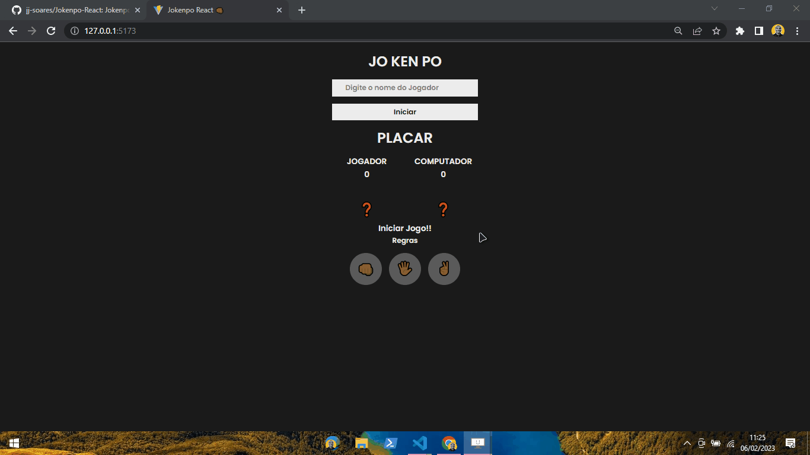

<h1 align="center">
Jo-Ken-Po game with React!! 🖐🏾👊🏾✌🏾
</h1>

<h4 align="center">
  😉 Project with to train React and improve in this technology
</h4>

## Photos 🎴
<div align ='center'>



</div>

<p align="center">   
   <a href="#On">On</a> .
   <a href="#Roadmap">Roadmap</a> .
   <a href="#Technologies">Technologies</a> .
   <a href="#Photos">Photos</a> . 
   <a href="#Author">Author</a> 
   
 </p>


   
 ## On ✔
     
   <p> This project was created with Vite to improve ease of construction!!</p>
   
   
   
 ## Roadmap 🗺
   
   <p> 
With this project I was able to better apply learning a lot about componentization, 
in addition to being able to increase Hooks, to make the project more complete!!</p>
   
   
 ## Technologies 🚀
   
   <h3 align="center"> Technologies used in the project 🙃 </h3>
   
   

- [React](https://pt-br.reactjs.org/)  
- [Styled components](https://styled-components.com/)  
- [JavaScript](https://www.javascript.com/)
- [Yarn](https://yarnpkg.com/)  
- [Vite](https://vitejs.dev/)  


<br>
<br>

## Running the project 🎢

```bash
# Clone Repository
$ git clone 

# Install Dependencies
$ yarn install or npm install

# Run Aplication
$ yarn dev or npm dev 

```
Go to http://127.0.0.1:5173/ to see the result.

   

## Author 🏾‍♂️
   <p> Hello, my name is João. <br> Follow me on <a href="https://www.linkedin.com/in/joaosoaressilva/" target="_blank">Linkedin</a> to see more about the projects I post.!</p>

## License 📝

This project is under the [MIT license](./LICENSE).


   
